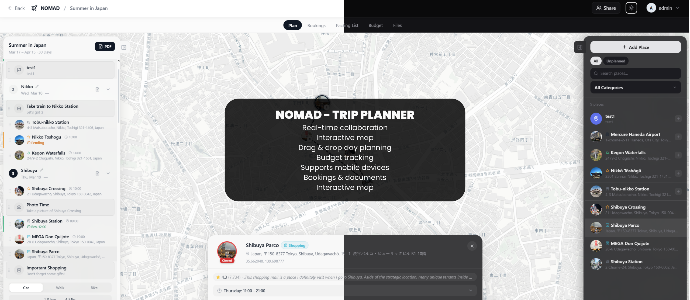

# NOMAD

**Navigation Organizer for Maps, Activities & Destinations**

A self-hosted, real-time collaborative travel planner for organizing trips with interactive maps, budgets, packing lists, and more.

[](LICENSE)
[](https://hub.docker.com/r/mauriceboe/nomad)
[](https://github.com/mauriceboe/NOMAD)
[](https://github.com/mauriceboe/NOMAD/commits)

**[Live Demo](https://demo-nomad.pakulat.org)** — Try NOMAD without installing. Resets hourly.



## Features

- **Real-Time Collaboration** — Plan together via WebSocket live sync — changes appear instantly across all connected users
- **Interactive Map** — Leaflet map with marker clustering, route visualization, and customizable tile sources
- **Google Places Integration** — Search places, auto-fill details including ratings, reviews, opening hours, and photos (requires API key)
- **Drag & Drop Planner** — Organize places into day plans with reordering and cross-day moves
- **Weather Forecasts** — Current weather and 5-day forecasts with smart caching (requires API key)
- **Budget Tracking** — Category-based expenses with pie chart, per-person/per-day splitting, and multi-currency support
- **Packing Lists** — Categorized checklists with progress tracking, color coding, and smart suggestions
- **Reservations & Bookings** — Track flights, hotels, restaurants with status, confirmation numbers, and file attachments
- **Document Manager** — Attach documents, tickets, and PDFs to trips, places, or reservations (up to 50 MB per file)
- **PDF Export** — Export complete trip plans as PDF with images and notes
- **Multi-User** — Invite members to collaborate on shared trips with role-based access
- **Admin Panel** — User management, create users, global categories, API key configuration, and backups
- **Auto-Backups** — Scheduled backups with configurable interval and retention
- **Route Optimization** — Auto-optimize place order and export to Google Maps
- **Day Notes** — Add timestamped notes to individual days
- **Dark Mode** — Full light and dark theme support
- **Multilingual** — English and German (i18n)
- **Mobile Friendly** — Responsive design with touch-optimized controls
- **Customizable** — Temperature units, time format (12h/24h), map tile sources, default coordinates

## Tech Stack

- **Backend**: Node.js 22 + Express + SQLite (`node:sqlite`)
- **Frontend**: React 18 + Vite + Tailwind CSS
- **Real-Time**: WebSocket (`ws`)
- **State**: Zustand
- **Auth**: JWT
- **Maps**: Leaflet + react-leaflet-cluster + Google Places API (optional)
- **Weather**: OpenWeatherMap API (optional)
- **Icons**: lucide-react

## Quick Start

```bash
docker run -d -p 3000:3000 -v ./data:/app/data -v ./uploads:/app/uploads mauriceboe/nomad
```

The app runs on port `3000`. The first user to register becomes the admin.

<details>
<summary>Docker Compose (recommended for production)</summary>

```yaml
services:
  app:
    image: mauriceboe/nomad:latest
    container_name: nomad
    ports:
      - "3000:3000"
    environment:
      - NODE_ENV=production
      - PORT=3000
    volumes:
      - ./data:/app/data
      - ./uploads:/app/uploads
    restart: unless-stopped
```

```bash
docker compose up -d
```

</details>

### Updating

```bash
docker pull mauriceboe/nomad
docker rm -f nomad
docker run -d --name nomad -p 3000:3000 -v /your/data:/app/data -v /your/uploads:/app/uploads --restart unless-stopped mauriceboe/nomad
```

Or with Docker Compose: `docker compose pull && docker compose up -d`

Your data is persisted in the mounted `data` and `uploads` volumes.

### Reverse Proxy (recommended)

For production, put NOMAD behind a reverse proxy with HTTPS (e.g. Nginx, Caddy, Traefik).

> **Important:** NOMAD uses WebSockets for real-time sync. Your reverse proxy must support WebSocket upgrades on the `/ws` path.

<details>
<summary>Nginx</summary>

```nginx
server {
    listen 80;
    server_name nomad.yourdomain.com;
    return 301 https://$host$request_uri;
}

server {
    listen 443 ssl http2;
    server_name nomad.yourdomain.com;

    ssl_certificate /path/to/fullchain.pem;
    ssl_certificate_key /path/to/privkey.pem;

    location /ws {
        proxy_pass http://localhost:3000;
        proxy_http_version 1.1;
        proxy_set_header Upgrade $http_upgrade;
        proxy_set_header Connection "upgrade";
        proxy_set_header Host $host;
        proxy_set_header X-Real-IP $remote_addr;
        proxy_set_header X-Forwarded-For $proxy_add_x_forwarded_for;
        proxy_set_header X-Forwarded-Proto $scheme;
        proxy_read_timeout 86400;
    }

    location / {
        proxy_pass http://localhost:3000;
        proxy_set_header Host $host;
        proxy_set_header X-Real-IP $remote_addr;
        proxy_set_header X-Forwarded-For $proxy_add_x_forwarded_for;
        proxy_set_header X-Forwarded-Proto $scheme;
    }
}
```

</details>

<details>
<summary>Caddy</summary>

Caddy handles WebSocket upgrades automatically:

```
nomad.yourdomain.com {
    reverse_proxy localhost:3000
}
```

</details>

## Optional API Keys

API keys are configured in the **Admin Panel** after login. Keys set by the admin are automatically shared with all users — no per-user configuration needed.

### Google Maps (Place Search & Photos)

1. Go to [Google Cloud Console](https://console.cloud.google.com/)
2. Create a project and enable the **Places API (New)**
3. Create an API key under Credentials
4. In NOMAD: Admin Panel → Settings → Google Maps

### OpenWeatherMap (Weather Forecasts)

1. Sign up at [OpenWeatherMap](https://openweathermap.org/api)
2. Get a free API key
3. In NOMAD: Admin Panel → Settings → OpenWeatherMap

## Building from Source

```bash
git clone https://github.com/mauriceboe/NOMAD.git
cd NOMAD
docker build -t nomad .
```

## Data & Backups

- **Database**: SQLite, stored in `./data/travel.db`
- **Uploads**: Stored in `./uploads/`
- **Backups**: Create and restore via Admin Panel
- **Auto-Backups**: Configurable schedule and retention in Admin Panel

## License

[AGPL-3.0](LICENSE)
